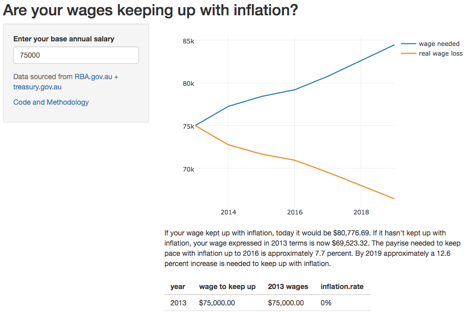

## Background

The idea for this app came as a result of a pay freeze in the public sector where I work. Consequently, I wanted to create an application where a worker could enter their pay in two ways:

- The amount their pay would need to be to have kept up with inflation
- The amount their current pay amounts to in 2013 terms, the year they last received a pay increase

[Click here to visit the application](https://ucg8j.shinyapps.io/wage_inflation_calculator/).

## Methodology {.smaller}
The main logic is defined in `global.R` where the `adj_wage()` function is defined. This function will
create a time series based on the starting wage the user enters. Depending on the argument provided it will deflate or inflate the wage for all future years.

```{r, eval=FALSE}
# return vector of adjusted wages
adj_wage <- function(wage, rates, inflate){

    wages <- vector()       # initialise vector
    wages <- c(wages, wage) # provide start value
    
    # for each inflation rate calculate inflated/deflated amount
    for (i in rates){
        
        # take the last wage value
        wage <- as.numeric(wages[length(wages)])
        
        if (inflate){
            w <- wage + (wage*i)
        } else {
            w <- wage - (wage*i)
        }
        wages <- c(wages,w)
    }
    
    return(wages[-1])
}
```

## Structure of the app {.smaller}
The app is structured as follows:

- ui.R
    - title
    - user input for wage
    - plotly interactive graph of time series
    - commentary
    - table of time series
- server.R
    - create time series using `adj_wage()`
    - create reactive commentary
    - create plotly graph
- global.R
    - load libraries
    - read inflation rates data
    - define `adj_wage()`

## Sceenshot of application

